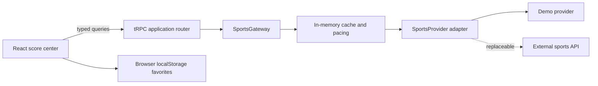

# SPORTS

> A polished, multi-sport live score center for following fixtures, results, standings, and match events from one responsive interface.

[](https://github.com/vincenzo-afk/SPORTS/actions/workflows/ci.yml)
[](LICENSE)
[](https://www.typescriptlang.org/)

[Getting started](#getting-started) · [Provider integration](SPORTS_PROVIDER.md) · [Report a bug](https://github.com/vincenzo-afk/SPORTS/issues/new?template=bug_report.yml) · [Request a feature](https://github.com/vincenzo-afk/SPORTS/issues/new?template=feature_request.yml)

---

## Table of contents

- [About](#about)
- [Tech stack](#tech-stack)
- [Getting started](#getting-started)
- [Usage](#usage)
- [Sports data interface](#sports-data-interface)
- [Project structure](#project-structure)
- [Features and roadmap](#features-and-roadmap)
- [Testing](#testing)
- [Deployment](#deployment)
- [Contributing](#contributing)
- [Security](#security)
- [License](#license)
- [Acknowledgments](#acknowledgments)

---

## About

**SPORTS** is a dark, responsive sports-score application built to keep live and scheduled competition data readable at a glance. It ships with a realistic multi-sport demo feed across football, basketball, tennis, cricket, rugby, ice hockey, and volleyball. The interface includes sport and fixture-state filters, all-state search, browser-persisted favorite matches, detailed match timelines and lineups, and league standings.

Its core integration design is intentionally provider-agnostic. A typed `SportsProvider` contract isolates external data mapping on the server, while the `SportsGateway` centralizes caching and request pacing. The browser only calls the application’s typed procedures; third-party sports credentials and provider-specific response shapes do not leak into the UI.

### Highlights

- **Live-first score center** with a 45-second active-page refresh interval, sport filters, and Live/Upcoming/Finished states.
- **Match center** with score segments, events, venue context, lineups, and a persistent favorite toggle.
- **League center** with competition metadata, standings where provided, and linked fixtures/results.
- **Local-first favorites** saved in browser `localStorage`; no account is required to pin a match.
- **Provider boundary** that supports adding a real sports API adapter without changing the frontend.
- **Server-side data gateway** with a 30-second in-memory cache and pacing between provider calls.

### Architecture



---

## Tech stack

| Area | Technology | Role in SPORTS |
| --- | --- | --- |
| Frontend | React 19.2, TypeScript 5.9, Vite 7.1 | Responsive client application and bundling. |
| Styling | Tailwind CSS 4.1, Radix UI, Lucide | Dark visual system, accessible primitives, and icons. |
| Backend | Node.js, Express 4.21, tRPC 11.6 | Typed server procedures and application runtime. |
| Data access | Drizzle ORM 0.44, MySQL-compatible driver | Built-in user and persistence integration. |
| Sports integration | `SportsProvider` contract and `SportsGateway` | API-agnostic data mapping, caching, and throttling. |
| Testing | Vitest 2.1 | Router, provider, cache, and auth procedure tests. |
| Package manager | pnpm 10.4 | Dependency installation and scripts. |

---

## Getting started

### Prerequisites

Install a recent Node.js LTS release and enable Corepack so that the repository uses its declared pnpm version.

```bash
corepack enable
node --version
pnpm --version
```

### Installation

```bash
git clone https://github.com/vincenzo-afk/SPORTS.git
cd SPORTS
pnpm install --frozen-lockfile
cp .env.example .env
pnpm dev
```

The development server starts the Express runtime with Vite attached. Open the local URL printed by the `dev` command.

### Configuration

The checked-in demo feed works with `SPORTS_PROVIDER=demo`. The template runtime also recognizes the following variables. Keep secrets out of version control and configure production values through your host’s secret-management service.

| Variable | Required for | Purpose |
| --- | --- | --- |
| `SPORTS_PROVIDER` | Sports feed selection | Selects the server-side provider registry entry. Defaults to `demo`. |
| `PORT` | Custom server port | Overrides the runtime port when self-hosting. |
| `NODE_ENV` | Production runtime | Controls production mode behavior. |
| `DATABASE_URL` | User persistence | MySQL-compatible connection used by the built-in database layer. |
| `JWT_SECRET` | OAuth sessions | Secret used by the session-cookie flow. |
| `VITE_APP_ID` | OAuth integration | Application identifier consumed by the OAuth setup. |
| `OAUTH_SERVER_URL` | OAuth integration | Server base URL for the OAuth service. |
| `VITE_OAUTH_PORTAL_URL` | Browser OAuth flow | Portal URL used by the client sign-in flow. |
| `OWNER_OPEN_ID` | Owner role assignment | Identifies the owner account for the built-in user role logic. |
| `BUILT_IN_FORGE_API_URL` | Optional platform integrations | Server-side base URL for built-in integration services. |
| `BUILT_IN_FORGE_API_KEY` | Optional platform integrations | Server-side credential for built-in integration services. |
| `VITE_FRONTEND_FORGE_API_URL` | Optional browser integrations | Client-facing base URL for built-in integration services. |
| `VITE_FRONTEND_FORGE_API_KEY` | Optional browser integrations | Client-facing integration credential supplied by the runtime. |

For a real sports API, implement the `SportsProvider` interface, register the adapter, and select it with `SPORTS_PROVIDER`. The complete integration contract is documented in [SPORTS_PROVIDER.md](SPORTS_PROVIDER.md).

---

## Usage

### Common routes

| Route | Purpose |
| --- | --- |
| `/` | Live scoreboard with sport filters, fixture-state tabs, all-state search, and favorites. |
| `/match/:matchId` | Score details, event timeline, score segments, and lineups when available. |
| `/league/:leagueId` | Competition overview, standings where provided, and related fixtures/results. |

### Development commands

```bash
# Start the local application
pnpm dev

# Type-check without emitting files
pnpm check

# Run the Vitest suite once
pnpm test

# Build browser and server bundles
pnpm build

# Run the built server bundle
pnpm start
```

### Adding a provider

1. Create `server/sports/<providerName>Provider.ts` implementing `SportsProvider` from `shared/sports.ts`.
2. Map the vendor response into the canonical `SportsMatch`, `SportsLeague`, and `StandingRow` models.
3. Register the provider in `server/sports/providerRegistry.ts`.
4. Set `SPORTS_PROVIDER=<providerName>` in the deployment environment.

The React pages and tRPC procedures remain unchanged. See [SPORTS_PROVIDER.md](SPORTS_PROVIDER.md) for the full boundary and adapter outline.

---

## Sports data interface

The application exposes typed tRPC procedures under the `sports` router. They are application contracts rather than direct browser-to-vendor API calls.

| Procedure | Input | Returns |
| --- | --- | --- |
| `sports.feed` | Optional sport, state, league ID, and search term | Matching score feed, leagues, active provider name, and refresh timestamp. |
| `sports.match` | Match ID | A match center record or `null`. |
| `sports.league` | League ID | Competition metadata or `null`. |
| `sports.standings` | League ID | Provider-supplied standings rows. |

The shared contract supports the following sport codes: `football`, `basketball`, `tennis`, `cricket`, `rugby`, `ice-hockey`, `volleyball`, `baseball`, and `handball`.

---

## Project structure

<details>
<summary>Expand the main project layout</summary>

```text
.
├── client/
│   └── src/
│       ├── components/          # App shell, sports cards, states, and UI primitives
│       ├── hooks/               # Browser-persisted favorites and UI hooks
│       ├── pages/               # Scoreboard, match detail, and league screens
│       ├── App.tsx              # Route registration
│       └── index.css            # Global dark visual system
├── drizzle/                     # Database schema and migrations
├── server/
│   ├── routers/                 # Typed sports procedure router
│   ├── sports/                  # Provider adapters, registry, cache gateway, and tests
│   ├── _core/                   # Runtime, OAuth, tRPC, and platform helpers
│   └── routers.ts               # Application router composition
├── shared/
│   └── sports.ts                # Canonical sports models and provider contract
├── .github/                     # CI, maintenance automation, templates, and ownership
├── SPORTS_PROVIDER.md           # Real-provider integration guide
└── package.json                 # Scripts and dependency declarations
```

</details>

---

## Features and roadmap

### Implemented

- ✅ Responsive multi-sport scoreboard and score filters.
- ✅ Active-page polling for the current feed.
- ✅ Match event timelines, scoring breakdowns, and optional lineups.
- ✅ League details and provider-supplied standings.
- ✅ Local browser favorites with a dedicated pinned-match bar.
- ✅ Typed server-side provider gateway with caching and request pacing.
- ✅ Demo provider seeded with realistic multi-sport fixtures.

### Current limitations

- The included provider is a demo adapter; a production sports API is not configured.
- Standings depend on the active provider. The demo provider currently supplies a Premier League table only.
- No account-based synchronization is implemented; favorites stay in the current browser.

See [CHANGELOG.md](CHANGELOG.md) for recorded repository changes.

---

## Testing

The test suite uses Vitest and covers logout behavior plus sports gateway filtering, cache behavior, provider selection, and typed router queries.

```bash
pnpm check
pnpm test
pnpm build
```

Continuous integration runs these same validation commands on pushes and pull requests to `main`. The workflow configuration is available at [.github/workflows/ci.yml](.github/workflows/ci.yml).

---

## Deployment

Build the application with the repository script:

```bash
pnpm build
NODE_ENV=production pnpm start
```

The production process expects a Node.js environment and the configuration described above. This repository does not include Docker, Compose, Kubernetes, or provider-hosting configuration; select a Node-capable host, set the environment variables through that host, and keep sports API credentials server-side.

---

## Contributing

Contributions are welcome. Please read [CONTRIBUTING.md](CONTRIBUTING.md) before opening an issue or pull request and follow the standards in [CODE_OF_CONDUCT.md](CODE_OF_CONDUCT.md).

For changes to the provider layer, preserve the API-agnostic shared models and do not introduce vendor-specific fields into UI components.

---

## Security

Please follow [SECURITY.md](SECURITY.md) to report a vulnerability privately. Do not include credentials, access tokens, or provider secrets in issues, pull requests, tests, or fixture data.

---

## License

This project is released under the [MIT License](LICENSE). Copyright © 2026 BHARANI KUMAR S.

---

## Acknowledgments

SPORTS is built with React, Vite, Express, tRPC, Tailwind CSS, Drizzle ORM, and Vitest. The live-score interface is designed around the needs of multi-sport match tracking and uses a typed demo provider for an immediately runnable experience.

---

<p align="center">
  Built and maintained by <a href="https://github.com/vincenzo-afk">BHARANI KUMAR S</a>.
  <br />
  <a href="#sports">Back to top</a>
</p>
